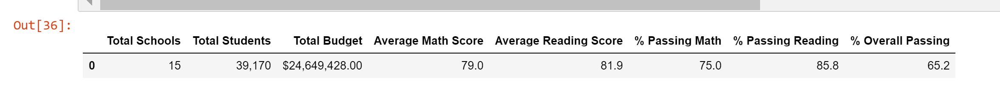

# School District Analysis

## Overview of School District Analysis

Maria, the chief data scientist for the City School District, has engaged me to help her analyze and present standardized math and reading test scores across 15 different schools to inform future funding allocations.  I am tasked with analyzing every student's test scores, aggregate the data, and shows trends in school performance.  Our analysis will assist school board officials make decisions and prioritize funding across schools under their purview.  The objectives of the analysis include:

   1. Read data from flat comma seperated value Excel files.
   2. Wrangle the student and school datasets to account for missing data, miscoded fields, and ensure readability.
   3. Merge the datasets to create a comprehensive analysis on school and student performance.
   4. Calculate the number of students and number of schools.
   5. Calculate the total budget for each school and each school's budget per student.
   6. Calculate the average scores per student for math, reading, and both math and reading.
   7. Calculate the passing rates for each school and the percentage of students that pass their tests.
   8. Determine the lowest and highest performing schools.
   9. Create size, school-type, grade-level, school-specific, and spending-related analyses.

After the initial school district analysis was finished, the school board notified Maria and her supervisor that there was evidence of academic dishonesty.  It appeared that the math and reading scores for all 9th graders at Thomas High School was had been altered.  To objectively report the student's test scores, Maria directed me to update the impacted reading and math scores with "NaN" or not a number values.  The following report addresses the findings as a result of the update.
 
### Resources

* Data Source:  schools_complete.csv, students_complete.csv
* Software:  Python 3.6.1, Visual Studio Code, 1.38.1
* Packages:  Pandas, NumPy

## Updated School District Analysis Results

### How was the district summary affected?

The district summary slighly decreased as a result of the restatement.  As you can see from the images below, the average math score decreased by 0.1 points, but the average reading score was not impacted.  Interestingly, all three passing percentages (math, reading, and both) decreased after the revision.

Revised analysis and script:

Initial summary of districts:

### How was the school summary affected?

There were two school summaries calculated for Thomas High School.  The initial school summary (calculated in step 5 of the Module challenge) used the total student count as the denominator in the pass rate calculations.  As you will see below, it drastically understates the pass rates, because the entire 9th grade class is counted as failing both math and reading.  

In the initial calculation, Thomas High School's average math scores dropped more than 1.1 points, but their average reading scores increase nearly 0.5 points.  While that seems modest, the changes in the pass rates are much more pronounced.  The pass rates for math decreased by nearly 27 percent, the reading pass rates dropped nearly 28 percent, and the overall pass rate went down 25 percdent.

Revised initial analysis of schools (from step 5 of the Module challenge):

Initial analyis summary of schools (with 9th grade test scores):

After excluding the 9th grade test scores and student counts, Thomas High School's metrics were almost identical to the initial analysis.  That leads me to believe that the 9th grade test scores had an immaterial impact on the outcome.  The images below show the code and impact on the school summary.

Code to isolate 10th to 12th graders' test results:

Revised analysis of schools (10th to 12th graders only):

Initial analysis summary of schools (with 9th grade test scores):

### How does replacing the ninth graders’ math and reading scores affect Thomas High School’s performance relative to the other schools?

If the 9th graders were excluded from the count, then the impact is negligible.  Thomas High School would remain the second best school in the district.  However, if we counted the 9th class in the denominator of the pass-rate calculation, then Thomas High School would be in the bottom five schools in the district.

Revised ranking (10th to 12th graders only):

Initial ranking (with 9th grade test scores):

### How does replacing the ninth-grade scores affect the following:

  * Math and reading scores by grade

  When rounding to the nearest tenth, math scores by grade did not change except for omitting the 9th grade math scores.

  Revised ranking (10th to 12th graders only):
  

  Initial ranking (with 9th grade test scores):
  

  When rounding to the nearest tenth, reading scores did not change either except for omitting the 9th grade reading scores. 

  Revised ranking (10th to 12th graders only):
  

  Initial ranking (with 9th grade test scores):
  

  * Scores by school spending

  School spending was not different as a result of altering the 9th grade test scores.

  

  * Scores by school size
  
  Scores by school size did not change.  The figures below differ due to rounding.

  Revised school size (10th to 12th graders only):
  

  Initial school size (with 9th grade test scores):
  

  * Scores by school type

  Scores by school type also did not change.  The differences shown below are due to rounding.

  Revised school size (10th to 12th graders only):
  

  Initial school size (with 9th grade test scores):
    

## School District Analysis Summary

The largest change resulted from counting all Thomas High School students in the denominator of the percentage calculations.  This greatly skewed the data.  After focusing solely on the 10th to 12th grade Thomas High School students, the district summary statistics decreased slightly.  The average math scores and reading scores also decreased as a result of the revised analysis.  An additional byproduct of excluding the 9th grade test scores was the incomplete dataset for Thomas High School in the analysis by grade.  
